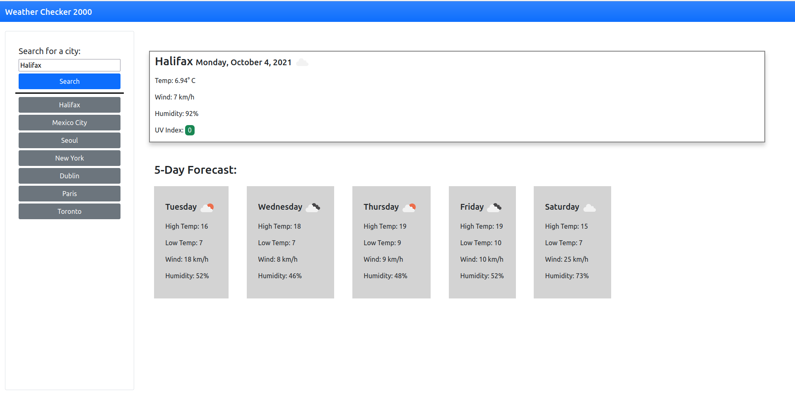

This application allows one to check for the temperature, wind speed, humidity, uv index, and 5 day forecast of a geographical region of their choice. It then saves the most recent searches as a set of buttons (total of 7); this persists through multiple sessions by using localStorage. 

application link: https://maplesyrupman.github.io/weather-checker-2000/ 
github repo: https://github.com/maplesyrupman/weather-checker-2000

